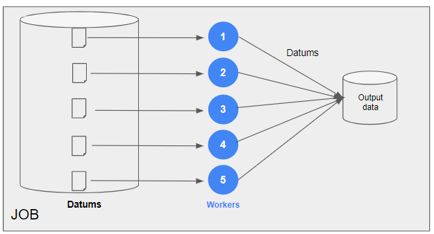
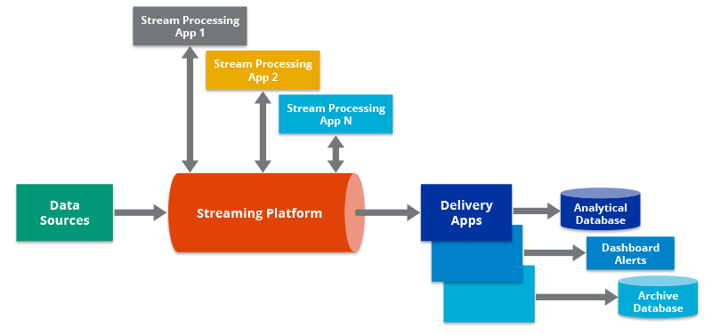

# Data Engineering 

## Data Engineering
- Data engineering involves the design, development, and maintenance of systems for collecting, storing, and processing data.
- It focuses on creating the infrastructure and architecture necessary for effective data management.

## Roles 

### Data Engineer

A data engineer is a professional responsible for building, testing, and maintaining the architecture (such as databases and large-scale processing systems) that allows for the efficient handling of data.

- Develop scalable data architecture 
- Streamline data acquisition
- Set up processes to bring together data
- Processing large amounts of data 
- Clean corrupt data
- Use of cluster of machines
- Well-versed in cloud technology 

### Data Scientist 

A data scientist is a professional who analyzes and interprets complex data sets to inform business decision-making.

- Mining data for patterns 
- Statistical modeling
- Build predictive models using machine learning
- Monitor business processes 
- Clean outliers in data 

## Tools of the Data Engineer

Data engineers move data from various sources, process it, and load it into an analytical database. They use multiple tools for these tasks.

### Databases

Data engineers are expert users of database systems. The data engineer's primary task revolves around databases.

- Hold large amounts of data
- SQL or NoSQL databases
- Other databases are used for analysis 

### Processing

Data engineers use tools for processing data quickly, cleaning, aggregating, or joining it from different sources.

- Clean data
- Aggregate data 
- Join data

Example: 

Parallel processing frameworks like PySpark are used behind the scenes for operations that may resemble simple pandas operations.

Parallel processing with clusters of machines:

### Scheduling

Scheduling tools ensure data moves correctly and timely.

- Manage jobs to run in the right order
- Resolve dependency requirements of jobs

###  Existing Tools

Databases:

- MySQL 
- PostgreSQL 

Processing:

- Apache Spark 
- Apache Hive 

Scheduling:

- Apache Airflow 
- Oozie 

## Data Pipeline

The data engineering pipeline involves extracting data from various sources, processing it with a cluster computing framework, and loading it into an analytical database.
- Scheduling frameworks like Airflow ensure tasks run in a specific order.
- External APIs or other file formats can also serve as data sources.
 

   

   
   

   <table>
   <tr>
      <td valign="top"></td>
   </tr>
   </table>