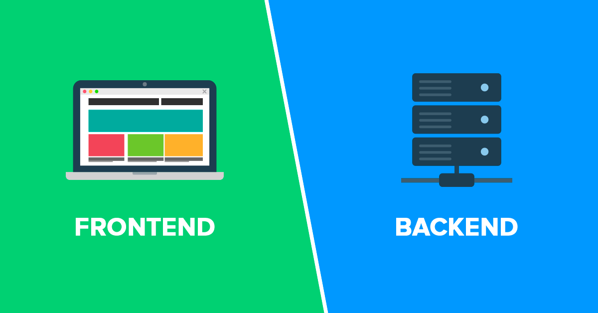
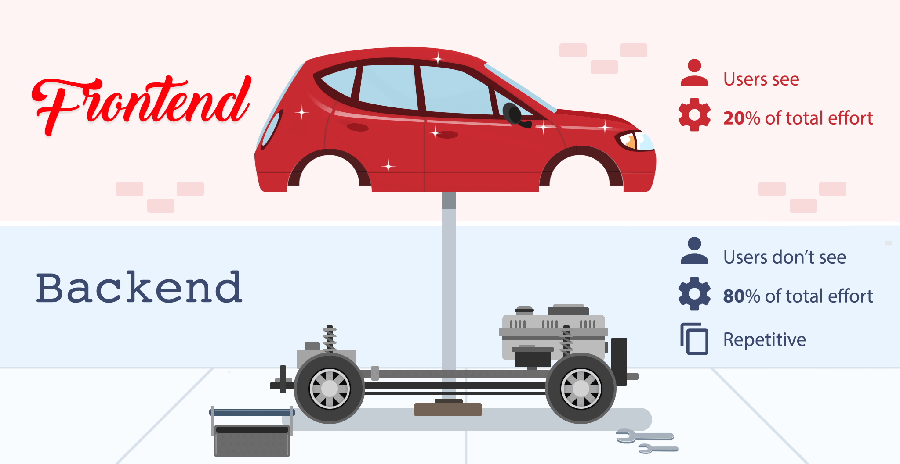
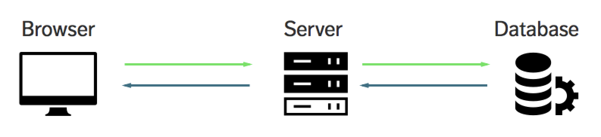

# Database Fundamentals

- [What is a Database](#what-is-a-database)
- [Where does the database fit in an application?](#where-does-the-database-fit-in-an-application)
- [How Data is Obtained](#how-data-is-obtained)

## What is a Database 

A **Database** is a software that is used to store data - basically any piece of information that we may need at a later time.

A lot of data that'll be stored in databases are used for data analytics. Organization use these data to predict patterns, find ways to utilize and improve them, and then determine strategies to best serve the customers

Common relational databases(SQL):
- MySQL
- SQL Server
- Oracle 
- DB2
- PostgreSQL

Common non-relatonal databases(NoSQL):
- MongoDB
- Cassandra
- SQLite
- Redis
- Couchbase

## Where does the database fit in an application?

An application consist of two main components: the frontend and the backend. 

The **frontend** is what the users see when they access a website or open the application in their devices. The user are able to see details through the frontend, as well as input informationbut they don't have access to the backend, where the database lies.

The **backend** is where the details are received, processed, and stored. This is where the server-side processing occurs. 

**Databases** are part of the backend of an application. They enable the application to "remember" any information by storing and organizing them.

<small>

Photo courtesy of [Future Era Solutions](https://future-era.solutions/posts/frontend-vs-backend) 

</small>

Another awesome analogy is the car below. As buyers we see the car base on its appearance, maybe some of us also get into the nitty-gritty details like model, mileage, and the sorts. As buyers, we see the "frontend".

  

<small>

Photo courtesy of [Back4App Blog](https://blog.back4app.com/backend-vs-frontend-4/) 

</small>

The gears, the chassis, and anything that happens under the hood (pun intended) are all part of the "backend" which buyers don't have to see.

## How Data is Obtained 

An applications's structure can vary from application to application and different organizations will have different ways of building applications, but in general, this is how data is obtained. 

1. User opens the application through a browser/device.
2. Application reach outs to API or backend server.
3. Backend server talks to the data layer, including the database.
4. Database receives the request and checks the collection or tables.
5. The database then passes the details back to API server, all the way to the application being accessed by the user.

## SQL versus NoSQL

Is there really a one-size-fits-all database for any application? Of course not! Each database will have their own use-case and it's important to know when to use which.

**SQL** or Standard Query Language Databases refers to structured, relational databases. With structure data, we have:

- the more tables, the more inserts are required 
- joins are required to retrieve data
- structure is hard to break
- organized data reduces redundant information
- data model cannot change easily
- data model needs to be thought of upfront to ensure consistency 
- however, requires more work for developers

**NoSQL**, on the other hand, refers to unstructured, non-relational databases. With NoSQL, we can:

- easily next data, allowing related details to be in one spot
- nested files solves the issue of needing to join documents 
- flexible structure allows for easy iterations
- structure can chane
- less time focusing on the database, more time to code

At the end, it's not a competition between the two. It all boils down to the problems you're tryng to solve, the skills you need to solve the problem, and of course, personal taste.

