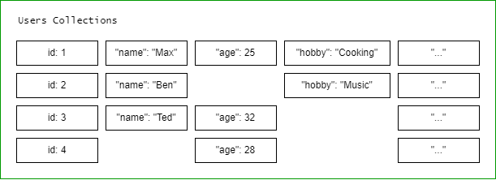
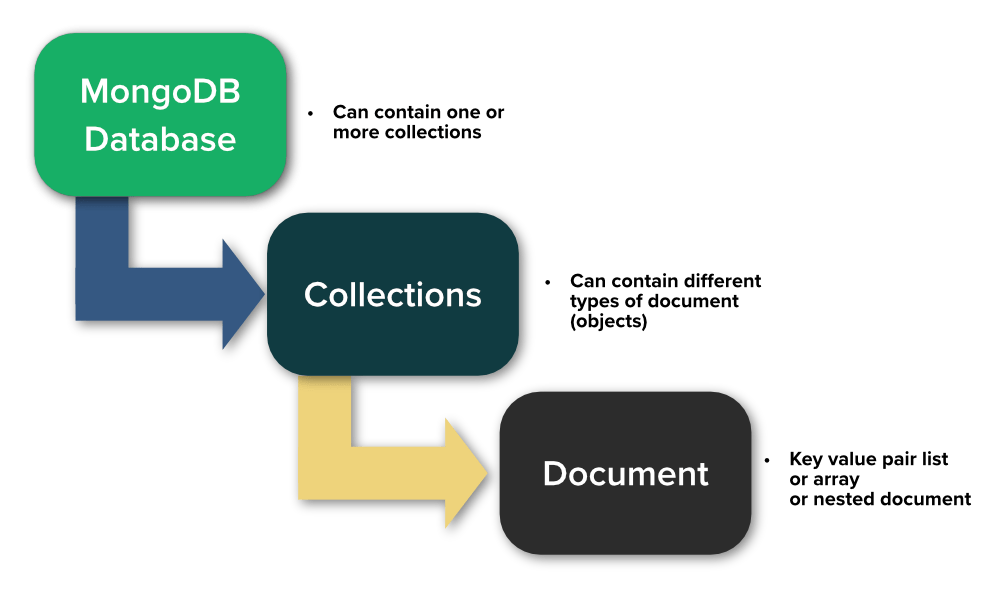

# MongoDB 


- [What is MongoDB](#what-is-mongodb)
- [How is MongoDB different?](#how-is-mongodb-different)
- [How do you store data?](#how-do-you-store-data)
- [The MongoDB Ecosystem](#the-mongodb-ecosystem)


## What is MongoDB

Interesting story. The name actually comes from "humoungous" which means something big and enormous. MongoDB is a NoSQL database solution that is designed to store lots and lots of data.

Instead of normalizing data, which means storing and distirbuting the data across multiple tables with schemas, MongoDB stores the unstructured data together without enforcing any schema.

"No schema" can lead to messy data, as we can see below, but it is the responsibility of developers to clean the data.

<p align=center>

</p>

With "no schema", there are also less relations across collections to managed. There are still some relations, but **embedded documents** allows for data to be together in a single document. 

An application will only need to reach for one collection to fetch all the data, instead of pulling the data from collection A and collection B, and then merging them.

## How is MongoDB different?

The MongoDB environment gives you an environment in which you can create a number of model databases inside. In other database solution, they have tables.

<p align=center>

</p>

*<center><small>Photo courtesy of [Studio3T](https://studio3t.com/academy/lessons/mongodb-basics/)</small></center>*

In MongoDB, we have **collections** which is similar to a table. Inside collections, we have **documents** which are basically objects where you store the actual data

Unlike SQL databases, MongoDB allows you store store totally different data: you can have one document which contains a schema and another document which is entirely schemaless.

## How do you store data?

We store the data in JSON (BSON) data format documents. THe documents are surrounded by curly braces and consists of key-value pairs. The values can be strings, booleans, and even nested data. This allows us to store data, create complex relations between the data, and store them in the same document.

Here's an example document inside of a collection. MongoDB converts the JSON format into a a Binary JSON format, which is why we call the new format as BSON.

```json 
{
    "name": "Max",
    "age": 29,
    "address":
        { "city": "Singapore" },
    "hobbies": [
        { "name": "Cooking" },
        { "name": "Sports" }
    ]
}
```

## The MongoDB Ecosystem

**MongoDB, the Company**

[MongoDB, Inc.](https://en.wikipedia.org/wiki/MongoDB_Inc.) is an American software company that develops and provides commercial support for the source-available database MongoDB, a NoSQL database that stores data in JSON-like documents with flexible schemas. To learn more, check out their [official website.](https://www.mongodb.com/company)

**MongoDB Database**

The core feature, a NoSQL database which is being offered as:

- Self-managed
- Enterprise

In addition to this, they also offer **Cloud Manager/OpsManager** that allows you to deploy, monitor, back up, and scale MongoDB anywhere. To learn more, check out the [Cloud Manager](https://www.mongodb.com/cloud/cloud-manager) site.

**MongoDB Atlas**

[MongoDB Atlas](https://www.mongodb.com/atlas) is a multi-cloud data platform that accelerates and simplifies building of data. Being a managed services, all the system administration is being taken care for us so that we can focus on data and logic.

**Compass**

[MongoDB Compass](https://www.mongodb.com/products/compass) is a graphical user interface (GUI) which allows developer to connect and access their database from a UI dashboard.

**Stitch**

[MongoDB Stitch](https://www.mongodb.com/collateral/mongodb-stitch-serverless-platform) is a serverless backend solution that enables developers to quickly build applications without having to set up server infrastructure. A decoupled database, Stitch is built on top of MongoDB Atlas. One of its feature is the **Serverless Query API** which we can use to query the database directly from the client-side apps.

Some other features include:

- Serverless Functions
- Database Triggers
- Real-Time Sync