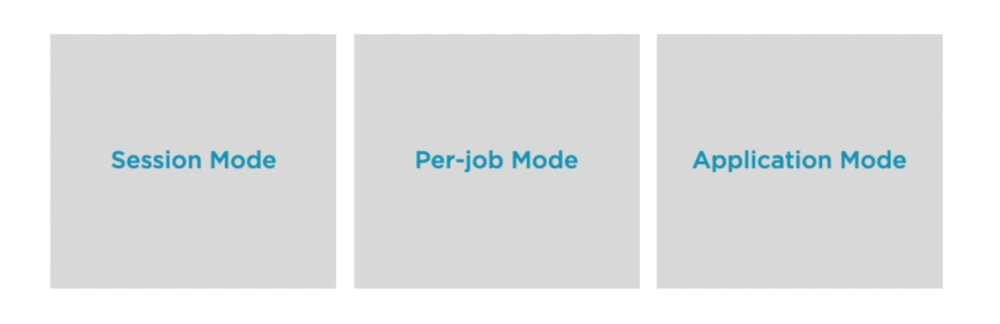

# Flink Clusters and Deployments

- [Deployment Modes](#deployment-modes)
    - [Flink Session Cluster](#flink-session-cluster)
    - [Flink Job Cluster](#flink-job-cluster)
    - [Flink Application Cluster](#flink-application-cluster)
- [Deployment Targets](#deployment-targets)

## Deployment Modes

A **Flink** application is any program that spawns a Flink job and executes these Flink jobs on either a virtual environment (local JVM) or a remote environment (remote cluster). There are three types of Flink clusters:

- Flink Session Cluster
- Flink Job Cluster
- Flink Application Cluster

### Flink Session Cluster

Previously known as **Session mode,** this cluster is a long-running, pre-existing cluster that can accept multiple job submissions.

- continues to be alive even after jobs have completed
- not bound to the lifetime of a particular job
- all jobs share the same cluster, thus **jobs compete for resources**
- TaskManager slots are allocated on job submission and release once job is complete
- if a JobManager/TaskManager crashes, all jobs using this components will fail
- having a pre-existing cluster saves time
- useful for interactive short-duration queries

### Flink Job Cluster

Previously known as **Per-job mode**, this cluster is specifically created for a particular job and is spun up by cluster manager such as YARN and Kubernetes. 

- each job will have its own Flink job cluster
- once job finishes, cluster is torn down
- **jobs do not compete for resources** since each has its own cluster
- crash of TM/JM only affects the one job that uses them
- provisiongin the cluster takes time
- useful for jobs that run for hours or days
- useful for jobs with high-stability requirements

### Flink Application Cluster

Previously known as **Application mode**, this is a dedicated cluster for a Flink application. In this setup, the Flink code is executed on the cluster, not on the client.

- cluster is closely tied to lifetime of application
- onc application finishes, cluster is torn down
- ResourceManager/Dispatcher is tied to one application

## Deployment Targets

There are various ways to deploy Flink:

- **Locally**, for testing
- **Standalone**, on VMs or baremetal servers 
- **YARN**, from Apache Hadoop's resource manager 
- **Docker**, for containerized Flink environment
- **Kubernetes**, for automated containerized deployment
- **Mesos**, for running distributed systems
